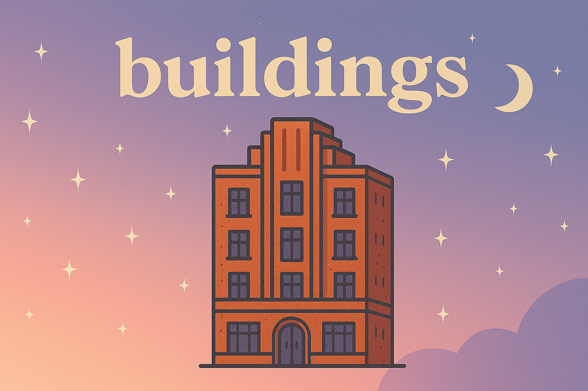

# 🏢 Buildings: Clearly Define What Your Bricks Build Towards

**Buildings** are clear, larger outcomes toward which your individual **Bricks** explicitly contribute. This concept clearly integrates into the **Output Brick Framework**, ensuring that your productivity efforts have a purposeful and clearly articulated direction.

---

## 📐 What is a Building?

A **Building** represents a clearly defined, meaningful outcome or goal. It explicitly answers the question:

> *"What larger goal or outcome is this Brick explicitly contributing towards?"*

Each Building clearly defines success and explicitly clarifies why the smaller tasks (Bricks) matter.

---

## 📝 Building Definition Template

Use this simple template to clearly define your Buildings:

```markdown
## 🏢 Building Name:
[A clear, simple name for your larger goal]

### 🎯 Clearly Defined Outcome:
[Explicitly describe what success explicitly looks like for this Building]

### 📅 Clear Success Indicators:
[Explicit, measurable indicators that show you've succeeded]

### 🧱 Required Bricks:
[List existing or required Bricks clearly tied to this Building]

### ⚠️ Key Friction or Challenges:
[Clearly articulate anticipated friction points or challenges at the Building level]
